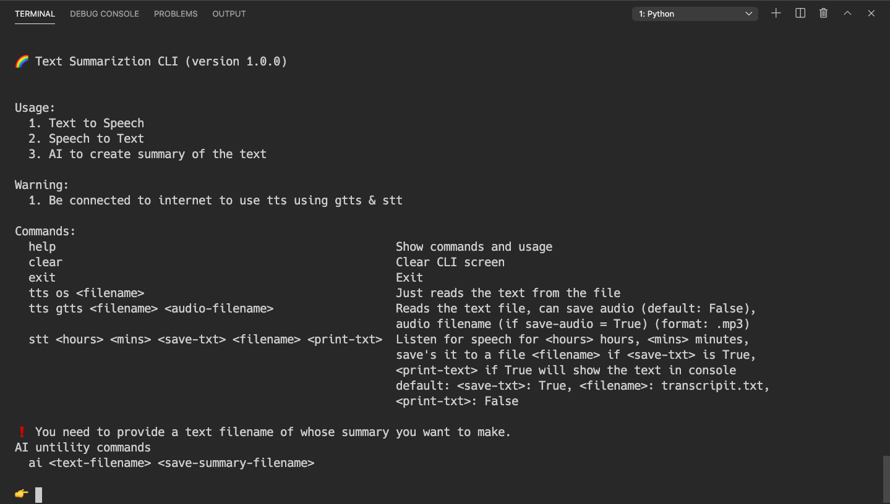
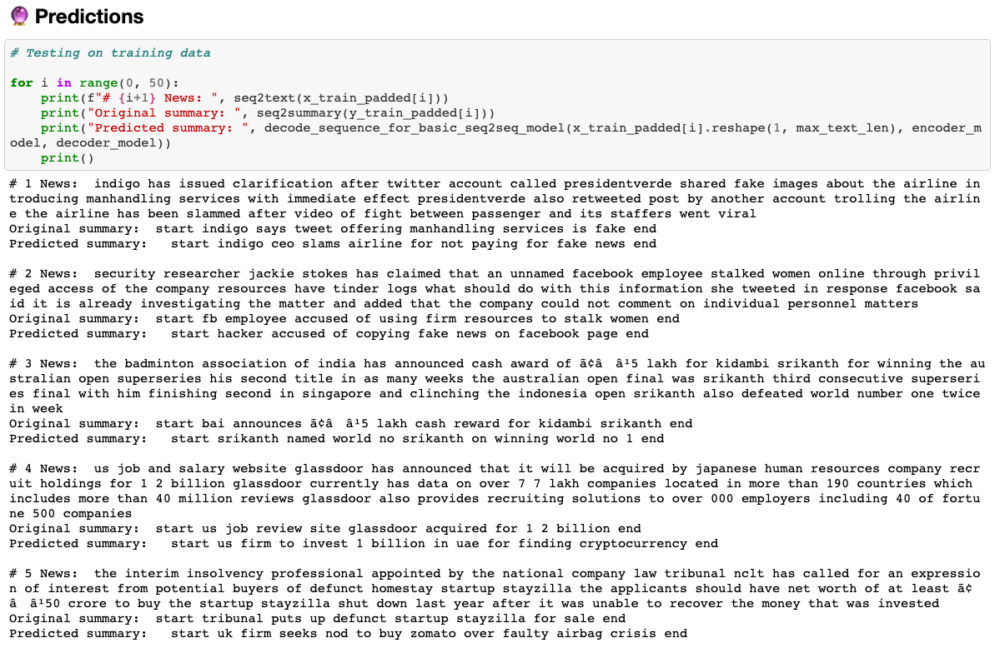
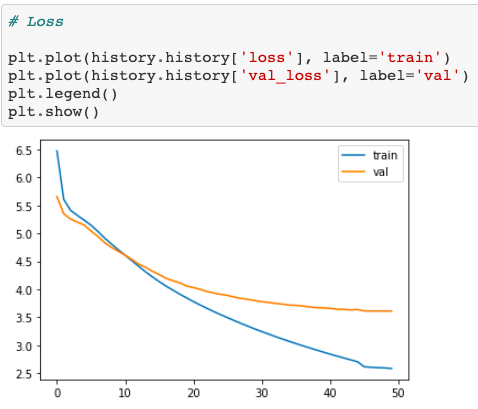
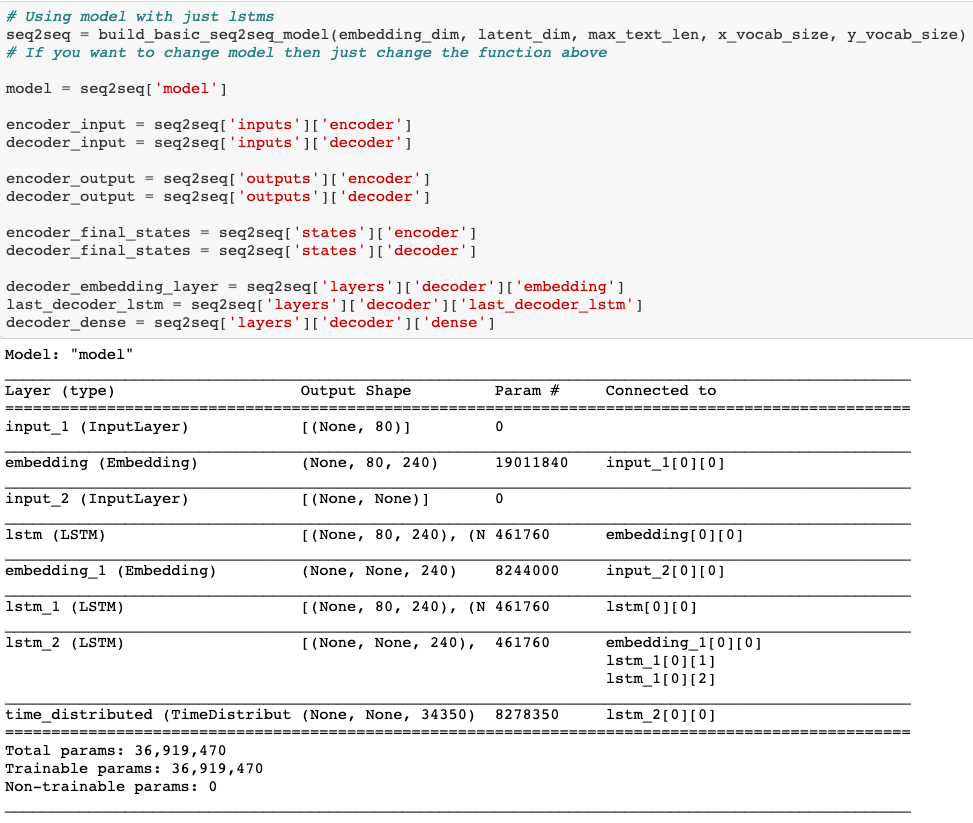
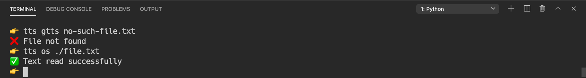

# online-lecture-summarizer

## 🎯 Project goal

- Create a CLI app which is integrated with AI model
- Using CLI you can record and save the audio, create a transcript of the audio and use the AI to the create the summary for that text.

## 🚀 Problem that this app solves

- Increase in online learning is great but has its own problems
- What if student has missed lectures? or wants to know exactly what has been done in a particular lecture? this is where OnlineLectureSummarizer comes in.
- Also storing so much lectures in video format on cloud is quite expensive, in this system you just have to store the text files which way more cheaper and overall this makes the your operations more scalable
- This system can also be used for offline lectures.

## 🔥 Features/Services it provides

- Recording audio which in this case is the lecture and saving it.
- Creating a transcript for any audio file
- Creating summary for any text file
- Listen to any audio using the CLI
- Convert transcript to an audio file
- Have fun

## 🍕 Solution

- Python language is used to create the CLI and the AI model
- Speech recognition and Google text to speech are packages are used in CLI
- Pandas, Numpy, Spacy, Sklearn and Tensorflow2 are the packages used for building the AI
- The AI model trained on a TPU and has an Encoder-Decoder architecture
- The DataScience techiques are used to work with data and dataset is split into training, validation/dev and test sets.

The data, jupyter notebook, main model, inferences encoder and decoder models and tokenizers for this can be found in Kaggle 👉 [link](https://www.kaggle.com/akashsdas/text-summarization)

## Images

